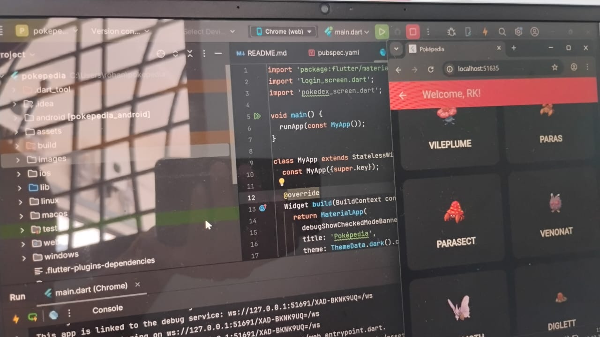
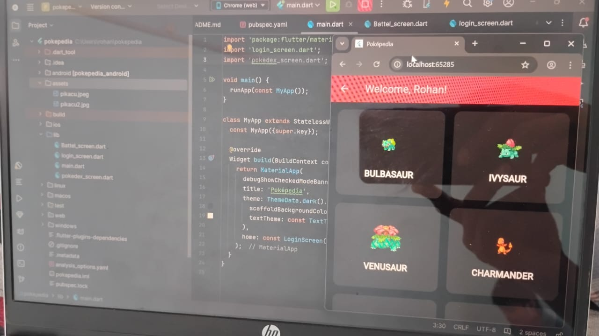

# pokepedia

A new Flutter project.

## Getting Started

This project is a starting point for a Flutter application.

A few resources to get you started if this is your first Flutter project:

- [Lab: Write your first Flutter app](https://docs.flutter.dev/get-started/codelab)
- [Cookbook: Useful Flutter samples](https://docs.flutter.dev/cookbook)

For help getting started with Flutter development, view the
[online documentation](https://docs.flutter.dev/), which offers tutorials,
samples, guidance on mobile development, and a full API reference.

# Poképedia (Pokédex App)

## 📌 Objective
A Flutter-based Pokédex app with login animation and Pokémon data from PokéAPI.

## 🚀 Features
- Login screen with Lottie animation 🎬
- Fetch Pokémon data from [PokéAPI](https://pokeapi.co/)
- Display Pokémon in a grid with names & images
- Dark-themed UI with red accents
- Responsive design
- Smooth navigation from login → Pokédex

## 📦 Packages Used
- `http` → API requests
- `lottie` → animations
- `google_fonts` → custom fonts
- `flutter_spinkit` → loading animations

## 📸 Screenshots

## 🔗 How to Run
1. Clone repo
2. Run `flutter pub get`
3. Add `assets/pokeball.json` in `assets/` folder & declare in `pubspec.yaml`
4. Run with `flutter run`
